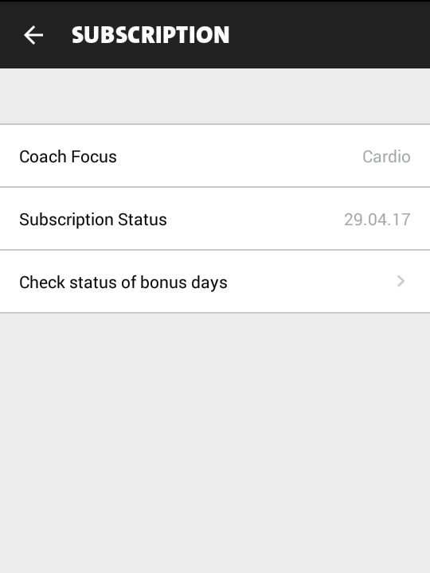
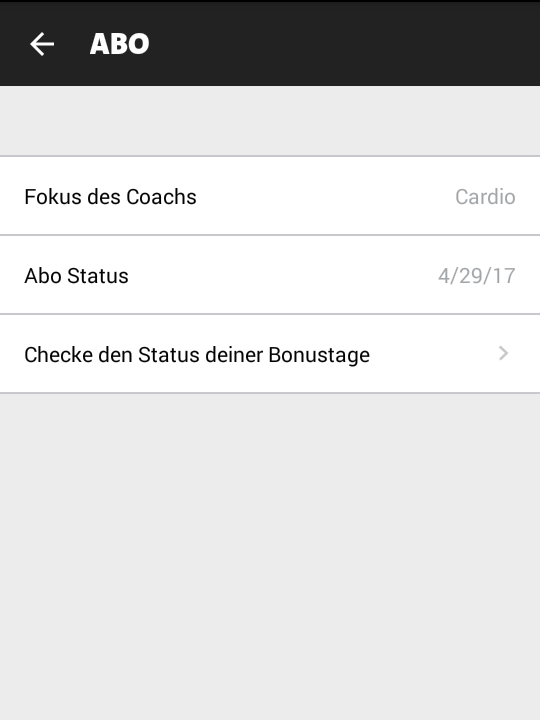
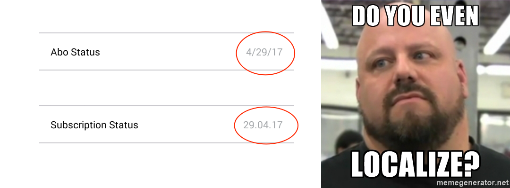

footer: © Edward Dale, 2016
slidenumbers: true
theme: Next

# Screenshot
## your Entire App
### Edward Dale
### Freeletics

---
# Screenshot
## your Entire App
## with Screengrab
## and Firebase
### Edward Dale
### Freeletics

---

# Find the bug(s)



---


---



---

# [fit] Some things
# [fit] are best
# [fit] verified visually
# [fit] :point_down:
# [fit] Screenshot

---

# Screenshots are useful for

* Acceptance testing
  * Edge case
  * Localization
  * Multiple devices
* Regression testing

---

# Screenshot testing tools

* Espresso tests
* Dependency injection
* Dependency mocking
* Screengrab
* Firebase Cloud Test Lab for Android

---

# Espresso test setup

```java

@MediumTest
public class BuyCoachScreenGrab {

    @Inject
    DummyUserManager mUserManager;

    @Rule
    public ActivityTestRule<BuyCoachActivity> mActivityRule = 
            new ActivityTestRule<>(BuyCoachActivity.class, 
                                   false, false);

```

---


Automated localized screenshots of your Android app on every device

Screengrab :arrow_forward: Fastlane :arrow_forward: Fabric :arrow_forward: Twitter

Combination of command-line tool and classes used in tests

---

# Screengrab test

```java
@Test
public void testTestimonialMale() {
    when(mUserManager.getUser().getGender()).thenReturn(Gender.MALE);
    mActivityRule.launchActivity(new Intent());
    onView(withId(R.id.feature_pager_videos)).perform(scrollTo());
    Screengrab.screenshot("buy_coach_male_testimonial");
}
```
---

# Screengrab test

```java
@Test
public void testTestimonialMale() {
    when(mUserManager.getUser().getGender()).thenReturn(Gender.MALE);
    mActivityRule.launchActivity(new Intent());
    onView(withId(R.id.feature_pager_videos)).perform(scrollTo());
    Screengrab.screenshot("buy_coach_male_testimonial");
}

@Test
public void testTestimonialFemale() {
    when(mUserManager.getUser().getGender()).thenReturn(Gender.FEMALE);
    mActivityRule.launchActivity(new Intent());
    onView(withId(R.id.feature_pager_videos)).perform(scrollTo());
    Screengrab.screenshot("buy_coach_female_testimonial");
}

```
---

# Screengrab configuration

```ruby
app_package_name 'com.freeletics.debug'
app_apk_path 'Freeletics-debug.apk'
tests_apk_path 'Freeletics-debug-androidTest.apk'
locales ['en-US', 'fr-FR', 'it-IT', 'de-DE', 
         'pt-PT', 'es-ES', 'tr-TR', 'ja-JA']
use_tests_in_classes ['com.freeletics.coach.view.BuyCoachScreenGrab']
```
---

# Running Screengrab


```bash
$ ./gradlew clean assembleDebug assembleDebugTest
$ screengrab
```

---

# Firebase Cloud Test Lab for Android

Test your app on devices hosted in a Google datacenter.

Combination of command-line tool and classes used in tests

Also supports virtual devices

---

# Firebase Cloud Test Lab for Android

Test your app on devices hosted in a Google datacenter.

Combination of command-line tool and classes used in tests

Also supports virtual devices

# $€£¥

---

# Firebase test

```java
@Test
public void testTestimonialMale() {
    when(mUserManager.getUser().getGender()).thenReturn(Gender.MALE);
    Activity activity = mActivityRule.launchActivity(new Intent());
    onView(withId(R.id.feature_pager_videos)).perform(scrollTo());
    ScreenShotter.takeScreenshot("buy_coach_male_testimonial", activity);
}
```
---

# Screengrab

```java
Screengrab.screenshot("buy_coach_male_testimonial");
```

# Firebase

```java
ScreenShotter.takeScreenshot("buy_coach_male_testimonial", activity);
```

---

# Running Firebase

```
gcloud beta test android run 
  --type instrumentation
  --app Freeletics-debug.apk
  --test Freeletics-debug-androidTest.apk
  --device-ids Nexus6
  --os-version-ids 21
  --locales en-US,fr-FR,it-IT,de-DE,pt-PT,es-ES,tr-TR,ja-JA
  --orientations portrait
  --test-targets "class com.freeletics.coach.view.BuyCoachScreenGrab"
```

Also possible to stick this in a YML configuration file.

---

# Screengrab 
## vs
# Firebase
## Fight!

---

# Screengrab

* :white_check_mark: Free
* :white_check_mark: No waiting for a free device
* :x: Limited by your devices

---

# Firebase

* :white_check_mark: Easy to setup a test matrix
* :white_check_mark: Fits well with a CI system
* :x: Have to wait your turn
* :x: Costs money 
	* $5/hour for real device
	* $1/hour for virtual device

---

# My suggestion

## Use both

---

# Cross-platform test

```java
@Test
public void testTestimonialMale() {
    when(mUserManager.getUser().getGender()).thenReturn(Gender.MALE);
    Activity activity = mActivityRule.launchActivity(new Intent());
    onView(withId(R.id.feature_pager_videos)).perform(scrollTo());
    ScreenShotter.takeScreenshot("buy_coach_male_testimonial", activity);
    Screengrab.screenshot("buy_coach_male_testimonial");
}
```

Screengrab for daily development
Firebase for CI regression testing

---


# Thanks!
## Edward Dale (@scompt)
## Freeletics (We're hiring)

